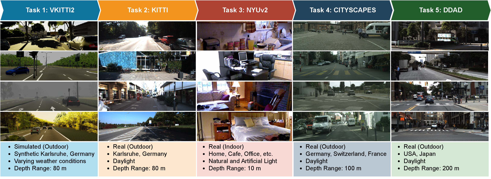
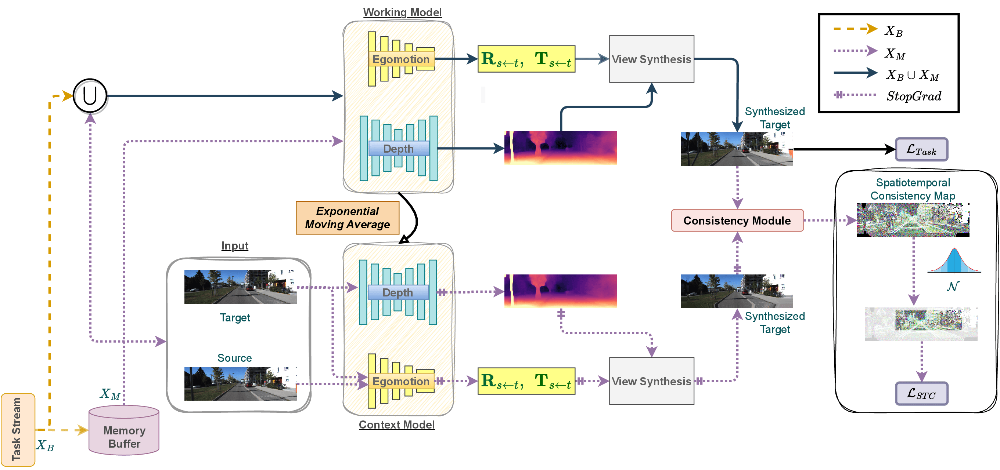

# CUDE-MonoDepthCL

- Code for [WACV'24](https://wacv2024.thecvf.com/) paper [Continual Learning of Unsupervised Monocular Depth from Videos](https://arxiv.org/abs/2311.02393) by
[Hemang Chawla](https://scholar.google.com/citations?user=3QSih2AAAAAJ&hl=en&oi=ao),
[Arnav Varma](https://scholar.google.nl/citations?user=JcqW3_QAAAAJ&hl=en&oi=ao), 
[Elahe Arani](https://scholar.google.nl/citations?user=e_I_v6cAAAAJ&hl=en&oi=ao) and 
[Bahram Zonooz](https://scholar.google.com/citations?hl=en&user=FZmIlY8AAAAJ).
--


We propose the CUDE framework for Continual Unsupervised Depth estimation with multiple tasks with domain and depth-range shifts, across various weather and lighting conditions, and sim-to-real, indoor-to-outdoor, outdoor-to-indoor scenarios. We also propose MonodepthCL - a method to mitigate catastrophic forgeting in CUDE. 

## Install

MonoDepthCL was trained on TeslaV100 GPU for 20 epochs for each task with AdamW optimizer at a resolution of (192 x 640) with a 
batchsize 12. The docker environment used can be setup as follows:

```
git clone https://github.com/NeurAI-Lab/MIMDepth.git
cd MIMDepth
make docker-build
```

## Training
MonodepthCL is trained in a self-supervised manner from videos. 
For training, utilize a `.yaml` config file or a `.ckpt` model checkpoint file with `train.py`.
```
python train.py <config_file.yaml or model_checkpoint.ckpt>
```
The splits used within the CUDE benchmark can be found in [splits](splits) folder.

## Cite Our Work
If you find the code useful in your research, please consider citing our paper:
<pre>
@inproceedings{cude2024wacv,
	author={H. {Chawla} and A. {Varma} and E. {Arani} and B. {Zonooz}},
	booktitle={Proceedings of the IEEE/CVF Winter Conference on Applications of Computer Vision},
	title={Continual Learning of Unsupervised Monocular Depth from Videos},
	year={2023}
}
</pre>

## License

This project is licensed under the terms of the MIT license.
